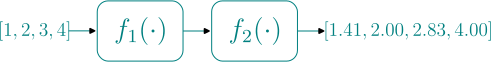

# Usage Guide

To design a preprocessing pipeline with `gepref` for a given type of data, you'll need to implement the **preprocessor** and the different **steps**. Let's see their definitions:

- **preprocessor**: the preprocessor acts like a pipeline that performs function composition over several preprocessing steps.
- **steps**: an step is an implementation of a preprocessing function that takes as input and returns the same data type.

In this guide we'll show how to implement a preprocessor and some steps with an example for lists of numbers.

## Preprocessor

The **preprocessor** is an object that handles data of an specific type and generates a transformed version of the same type. First, we'll import the base `GenericPreprocessor` class:

```python
from gepref.preprocessor import GenericPreprocessor
```

Now we can define the type of data (`List[float]`) to implement:

```python
from typing import List
T = List[float]
```

Finally, we create a preprocessor for this type of data:

```python
class ListPreprocessor(GenericPreprocessor[T]):
    ...
```

## Steps

Each **step** is a subtype of the `AbstractStep` generic interface. Let's import this class:

```python
from gepref.step import AbstractStep
```

Each **step** must implement the `call` method. Let's implement two steps:

1. The first **step** will perform the following operation for each element in the list {math}`\mathbf{x} = \left[x_1, x_2, \dots, x_m\right]`:

    ```{math}
    f_1(x_i) = 2 ^ {x_i}
    ```

    We can have this implemented as a **step**:

    ```python
    class SquareStep(AbstractStep[T]):
        def call(self, data: T) -> T:
            return list(map(lambda x_i: 2 ** x_i, data))
    ```

2. The second **step** will perform the following operation:

    ```{math}
    f_2(x_i) = \sqrt{x_i}
    ```

    The implementation:

    ```python
    class SqrtStep(AbstractStep[T]):
        def call(self, data: T) -> T:
            return list(map(lambda x_i: x_i ** 0.5, data))
    ```

## Example

Finally, we can define a preprocessing pipeline using the `ListPreprocessor`, `SquareStep` and `SqrtStep` to implement the following flow:



Let's see the pipeline:

```python
preprocessor = ListPreprocessor(
    steps=[SquareStep(), SqrtStep()]
)
```

We can test it:

```python
print(preprocessor([1, 2, 3, 4]))
```
